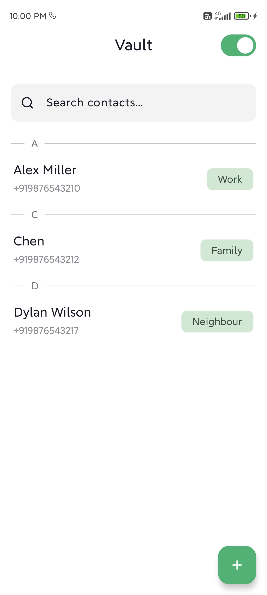
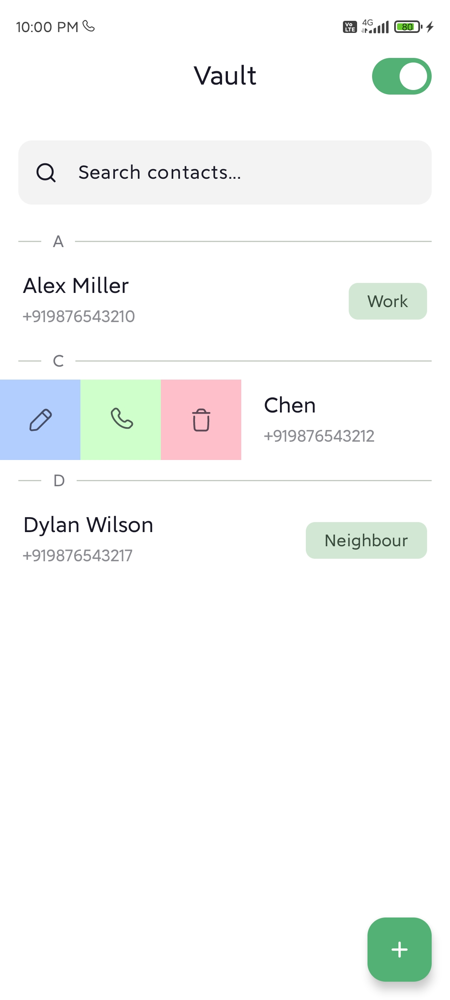
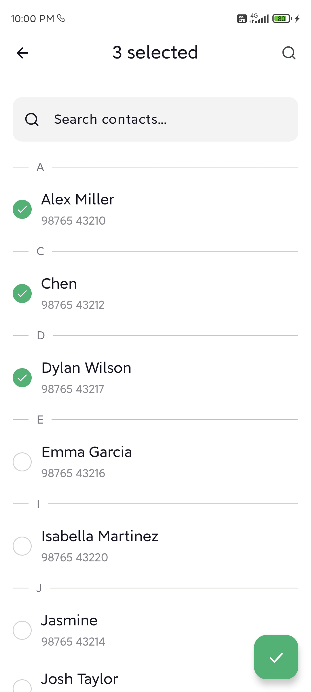
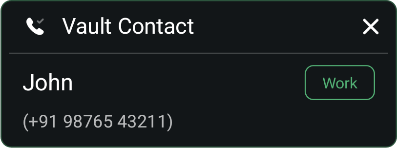
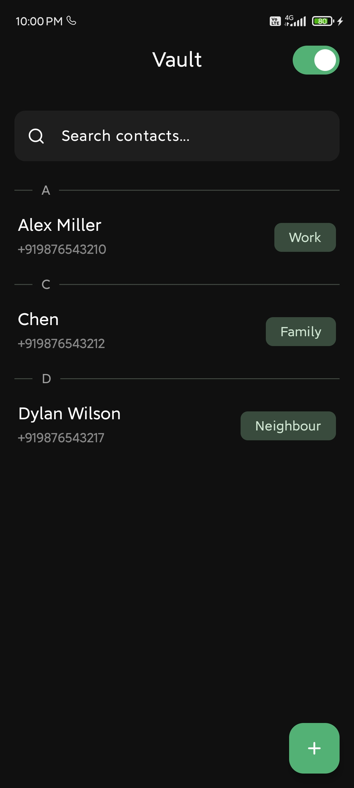
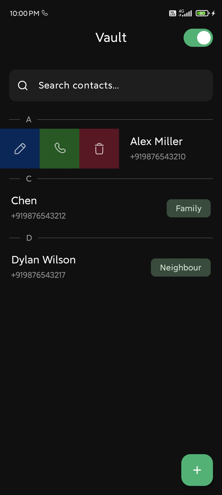
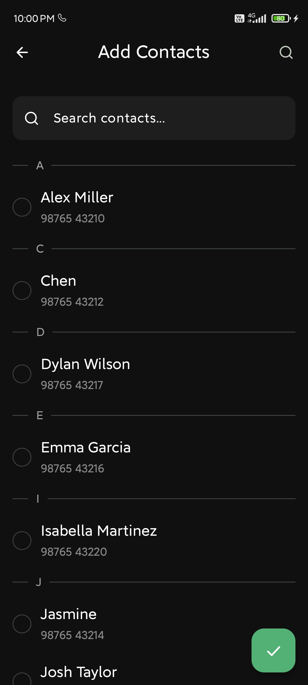

# Vault: Private Contacts & Caller ID (Offline)

  

Vault is an Android app that allows you to create a private list of contacts, separate from your
regular phone contacts. It provides caller ID functionality for these private contacts, even when
offline, and allows you to hide or unhide them from your system contacts.

## Features

* **Private Contact Vault:** Create a separate, secure list of contacts.
* **Offline Caller ID:** Identify incoming calls from your Vault contacts, even without an internet
  connection.
* **Hide/Unhide Contacts:** Control the visibility of Vault contacts in your system contacts.
* **Edit Contacts:** Modify contact details (name, category, etc.).
* **Delete Contacts:** Remove contacts from the Vault.
* **Search and Filter:** Easily find contacts within the Vault.
* **Call Functionality:** Initiate calls to Vault contacts directly from the app.
* **Customizable Call Notification:** Compose view based custom notification for incomming calls.

### Screenshots

 

  
  
  
   
  <i>(Light Mode)</i>

 

  
   
<i>(Notification)</i>

 

  
  
  
   
  <i>(Dark Mode)</i>

 

## Technologies Used

* **Kotlin:** The primary programming language.
* **Android Jetpack Compose:** Modern UI toolkit.
* **Room Persistence Library:** For local database storage.
* **Hilt:** Dependency injection.
* **AndroidX Libraries:** Core Android components.
* **Accompanist Permissions:** Simplified permission handling.

## Installation and Setup

1. Clone the repository: `git clone https://github.com/sens-sens/Vault-Android.git`
2. Open the project in Android Studio.
3. Sync Gradle files.
4. Build and run the app on an emulator or physical device.

**Note:** Ensure you have the latest Android Studio and SDK installed.

## APK Release

You can download the latest release APK [here](assets/vault-release.apk).

## Permissions

The app requires the following permissions:

* `READ_CONTACTS`: To access system contacts.
* `WRITE_CONTACTS`: To hide/unhide contacts from system contacts.
* `READ_PHONE_STATE`: To listen for phone state changes.
* `READ_CALL_LOG`: To retrieve incoming call numbers.
* `POST_NOTIFICATIONS`: To display notifications.

## Contributing

Contributions are welcome! Please feel free to submit pull requests or open issues for bug fixes or
feature requests.

## License

This project is licensed under the MIT License. See the `LICENSE` file for details.

## Author

[sens-sens](https://github.com/sens-sens)

## Contact

For any questions or feedback, please feel free to connect with me
on [LinkedIn](https://www.linkedin.com/in/senthil-sens/).